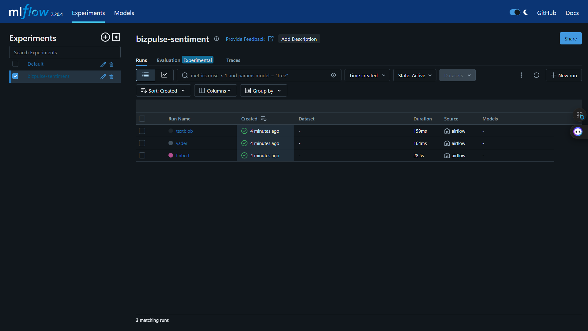
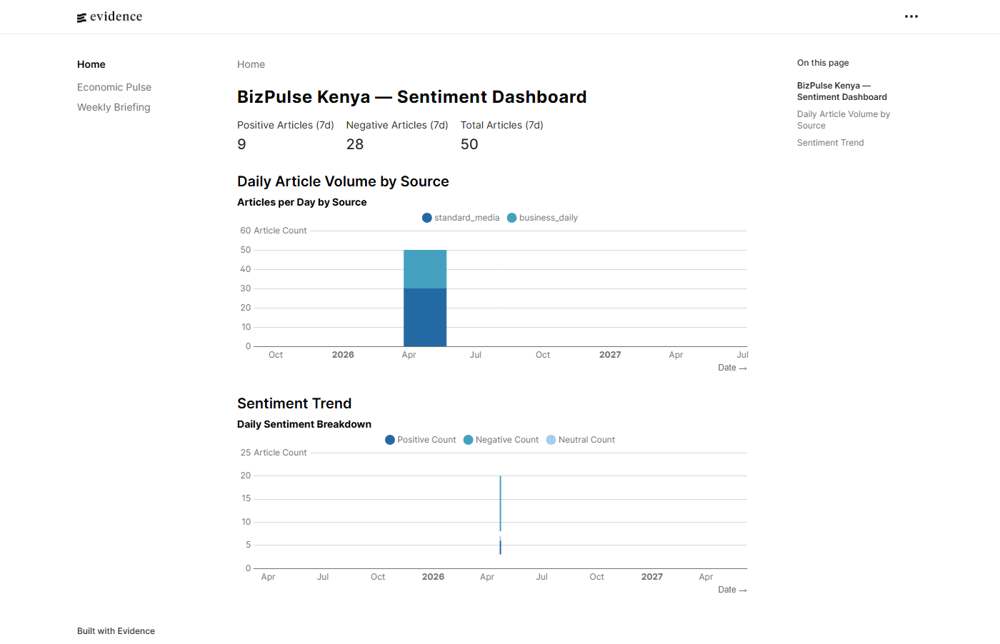
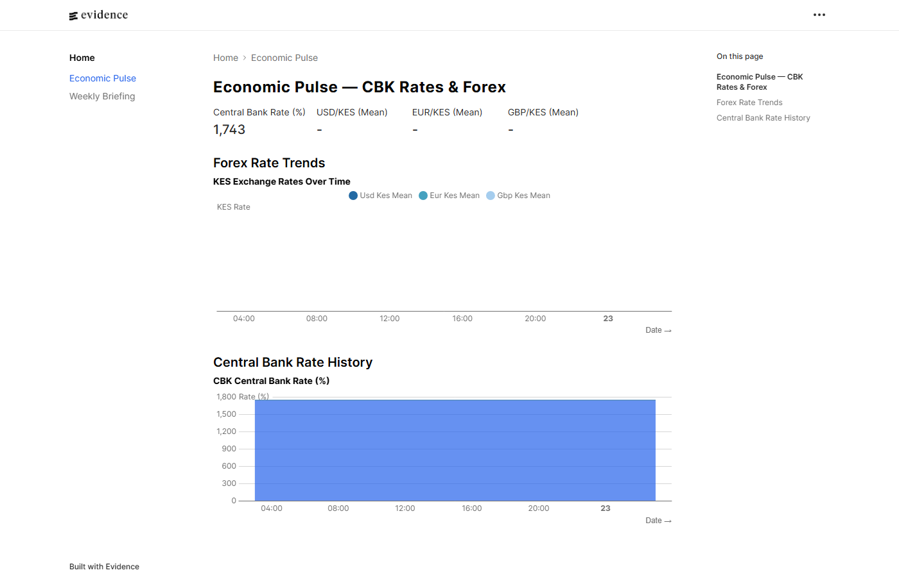
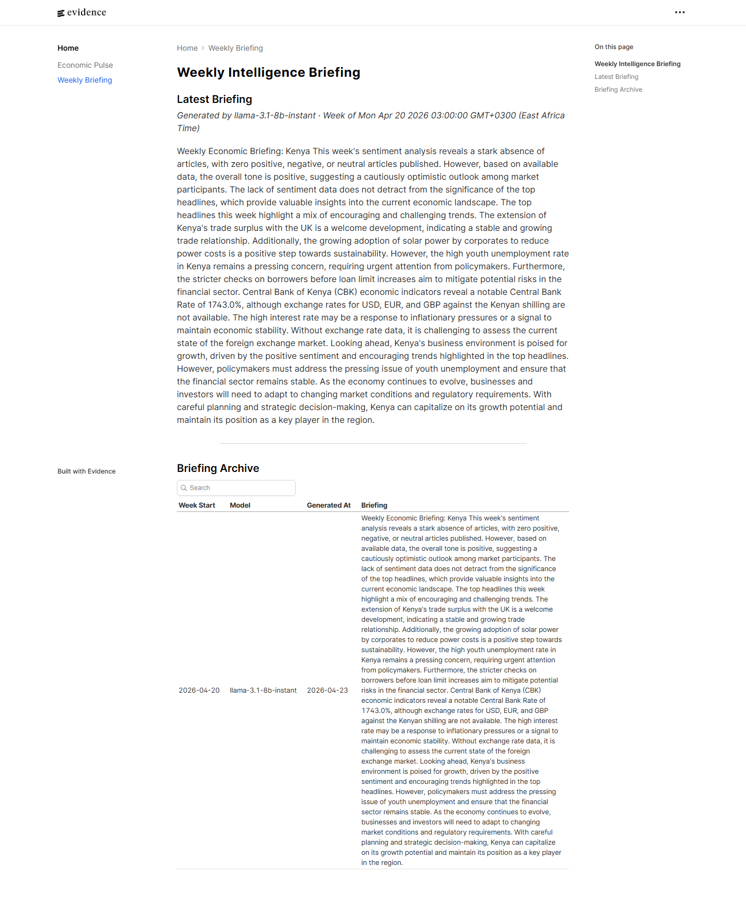

# 📰 BizPulse Kenya: Business News Sentiment & Economic Intelligence

**BizPulse Kenya** is a production-grade data engineering and AI solution designed to bridge the gap between raw Kenya business news and structured economic intelligence. It ingests daily articles from Business Daily Africa and Standard Media, scores sentiment using three competing NLP models tracked in MLflow, stores all data in a Snowflake cloud warehouse, and generates weekly AI briefings via a free LLM — all orchestrated by Apache Airflow 3.

---

## 🎯 Project Goal

Kenya's business press publishes hundreds of articles daily that collectively signal economic direction — but no structured data layer exists to quantify that signal. BizPulse Kenya solves this by running three sentiment models (FinBERT, VADER, TextBlob) against every article, logging each model's performance in MLflow, registering the champion (FinBERT) in a model registry, and synthesising the week's economic narrative into a professional briefing using LLaMA 3.1 8B via the free Groq API. The result is a live Evidence.dev dashboard tracking sentiment, forex trends, and CBK interest rates — with weekly AI-written reports anyone can read.

---

## 🧬 System Architecture

1. **Ingestion Layer** — `feedparser` parses RSS feeds from Business Daily Africa and Standard Media; `requests` + `BeautifulSoup4` scrape CBK indicative forex rates and interest rates daily
2. **Cloud Warehouse** — Snowflake (AWS af-south-1, Cape Town) stores raw articles and CBK data in the `RAW` schema; dbt transforms produce `STAGING` views and `MART` tables
3. **MLflow Experiment Tracking** — Three sentiment models run in parallel per DAG trigger; metrics (positive/negative/neutral counts, avg confidence, processing time) are logged per model; FinBERT is registered as the champion in the Model Registry
4. **Transformation Layer** — dbt-snowflake materialises 4 models (3 staging views + 1 mart table); 14 data quality tests enforce freshness and schema contracts; 2 mart tables (sentiment daily + weekly briefing) are written directly by the Python DAG and surfaced via Snowflake
5. **LLM Briefing** — Groq API (LLaMA 3.1 8B) synthesises the week's sentiment data, top headlines, and CBK indicators into a professional 3-paragraph economic briefing stored in Snowflake
6. **Orchestration** — Apache Airflow 3.0 (LocalExecutor) runs a 9-task DAG daily at 06:00 EAT
7. **BI Layer** — Evidence.dev connects directly to Snowflake MART schema and renders three live pages: Sentiment Dashboard, Economic Pulse, and Weekly Briefing

---

## 🛠️ Technical Stack

| **Layer** | **Tool** | **Version** |
|---|---|---|
| **Orchestration** | Apache Airflow | 3.0.0 |
| **Cloud Warehouse** | Snowflake | AWS af-south-1 |
| **Transformation** | dbt-snowflake | 1.8.4 |
| **Sentiment — Champion** | FinBERT (ProsusAI) | via transformers 4.44.2 |
| **Sentiment — Baseline 1** | VADER | vaderSentiment 3.3.2 |
| **Sentiment — Baseline 2** | TextBlob | 0.18.0 |
| **Experiment Tracking** | MLflow | 2.20.4 |
| **LLM Briefing** | LLaMA 3.1 8B (Groq) | groq 0.11.0 |
| **News Ingestion** | feedparser | 6.0.11 |
| **CBK Scraping** | requests + BeautifulSoup4 | 2.32.3 + 4.12.3 |
| **BI Dashboard** | Evidence.dev | 40.1.8 |
| **Containerisation** | Docker Compose | 8 services |
| **Language** | Python | 3.11 |
| **Testing** | pytest | 8.3.3 |

---

## 📊 Performance & Results

- **News sources:** 2 (Business Daily Africa + Standard Media Kenya)
- **Articles ingested:** updated daily via scheduled DAG
- **CBK data points:** forex rates (USD, EUR, GBP, JPY, CNY) + Central Bank Rate
- **MLflow experiments:** 3 models per run — FinBERT, VADER, TextBlob
- **Champion model:** FinBERT (ProsusAI/finbert) — trained on financial English text
- **dbt models:** 4 (3 staging views + 1 mart table)
- **dbt tests:** 14 covering uniqueness, not-null, accepted values, expression checks
- **DAG tasks:** 9 (scrape → load → sentiment → write-mart → dbt → briefing → log)
- **LLM briefing:** generated weekly using Groq free tier — zero API cost
- **pytest:** 17/17 passing

---

## 📸 Dashboard


*Apache Airflow 3 — bizpulse_kenya DAG showing all 9 tasks completed successfully*


*MLflow experiment tracking: finbert (28.5s), vader (164ms), textblob (159ms) — 3 runs per DAG trigger*


*Sentiment Dashboard: 9 positive, 28 negative, 50 total articles (7-day window); daily volume chart by source*


*Economic Pulse: Central Bank Rate 1,743 bps; CBK rate history chart*


*Weekly Intelligence Briefing generated by LLaMA 3.1 8B (Groq free tier); briefing archive table*

| Service | URL |
|---------|-----|
| Evidence.dev | http://localhost:3000 |
| Airflow UI | http://localhost:8080 |
| MLflow UI | http://localhost:5001 |

---

## 📡 Data Sources

| Source | Type | Frequency | Content |
|--------|------|-----------|---------|
| Business Daily Africa RSS | RSS feed | Continuous | Kenya business news |
| Standard Media Kenya RSS | RSS feed | Continuous | Kenya business & general news |
| CBK Indicative Rates | HTML scrape | Daily | USD/EUR/GBP/JPY/CNY vs KES |
| CBK Interest Rates | HTML scrape | Monthly | Central Bank Rate, interbank rates |

---

## 🧠 Key Design Decisions

- **Snowflake over PostgreSQL:** Cloud-native warehouse enables Evidence.dev native connector, scales to full historical dataset without DBA tuning, and demonstrates the cloud warehouse skill most common in Kenyan and global DE job descriptions
- **FinBERT as champion over VADER/TextBlob:** FinBERT (ProsusAI) was pre-trained on Financial PhraseBank — financial English text — making it significantly more accurate on business news than general-purpose rule-based tools; the MLflow experiment provides quantitative justification
- **MLflow experiment for all three models:** Running all three on the same article corpus at each DAG trigger provides ongoing model monitoring; if FinBERT degrades or a lighter model suffices, the registry can be updated without code changes
- **Groq free tier (not Ollama):** Groq's free tier (LLaMA 3.1 8B, 30K tokens/min) provides GPT-quality output with zero storage overhead — critical on a machine where VHDX compaction is required after every project; Ollama's minimum viable model adds 3.5GB
- **HuggingFace cache volume:** FinBERT (~440MB) is cached in a named Docker volume so subsequent runs do not re-download the model weights
- **Evidence.dev (not Streamlit/Grafana):** Code-first BI — dashboard logic lives in version-controlled markdown; native Snowflake connector requires zero custom SQL connector code

---

## 📂 Project Structure

```text
bizpulse-kenya/
├── .env.example                        # credential template
├── .gitignore
├── docker-compose.yml                  # 8-service stack
├── Dockerfile.airflow                  # Airflow 3 + torch CPU + transformers
├── requirements.txt
├── passwords.json                      # Airflow SimpleAuthManager
│
├── scripts/
│   ├── setup_snowflake.py              # one-time DB + table creation
│   └── evidence_entrypoint.sh          # Evidence.dev startup script
│
├── dags/
│   └── bizpulse_dag.py                 # 9-task Airflow DAG
│
├── ingestion/
│   ├── news_scraper.py                 # feedparser → RSS articles
│   ├── cbk_scraper.py                  # CBK forex + interest rates
│   └── snowflake_loader.py             # MERGE INTO Snowflake RAW
│
├── sentiment/
│   ├── finbert_scorer.py               # ProsusAI/finbert (champion)
│   ├── vader_scorer.py                 # VADER rule-based baseline
│   ├── textblob_scorer.py              # TextBlob polarity baseline
│   └── experiment_runner.py            # MLflow multi-model experiment
│
├── briefing/
│   └── generator.py                    # Groq LLaMA 3.1 8B weekly briefing
│
├── dbt/
│   ├── dbt_project.yml
│   ├── profiles.yml                    # gitignored — uses env_var()
│   ├── packages.yml
│   ├── macros/
│   │   └── generate_schema_name.sql    # override to use custom_schema directly
│   └── models/
│       ├── staging/
│       │   ├── sources.yml             # RAW schema source definitions
│       │   ├── stg_articles.sql
│       │   ├── stg_forex.sql
│       │   └── stg_rates.sql
│       └── mart/
│           ├── schema.yml              # 14 dbt tests
│           └── mart_economic_pulse.sql # CBK rates + forex aggregation
│
├── dashboard/                          # Evidence.dev
│   ├── package.json
│   ├── evidence.config.yaml
│   └── pages/
│       ├── index.md                    # Sentiment dashboard
│       ├── economic-pulse.md           # CBK rates + forex trends
│       └── weekly-briefing.md          # LLM briefings archive
│
├── tests/
│   ├── test_news_scraper.py            # 5 tests
│   ├── test_cbk_scraper.py             # 3 tests
│   ├── test_sentiment.py               # 7 tests
│   └── test_briefing.py                # 2 tests
│
└── assets/                             # dashboard screenshots
```

---

## ⚙️ Installation & Setup

### Prerequisites
- Docker Desktop (with WSL2 backend on Windows)
- Python 3.11+
- A free [Snowflake trial account](https://signup.snowflake.com/) (AWS, any region)
- A free [Groq API key](https://console.groq.com/) (no credit card required)

### 1. Clone and configure
```bash
git clone https://github.com/declerke/BizPulse-Kenya.git
cd BizPulse-Kenya
cp .env.example .env
# Edit .env with your Snowflake credentials and Groq API key
```

### 2. Create Snowflake schema (run once)
```bash
pip install snowflake-connector-python python-dotenv
python scripts/setup_snowflake.py
```

### 3. Start the stack
```bash
docker-compose up --build -d
```

### 4. Access services (wait ~5 minutes for Airflow to initialise)

| Service | URL | Credentials |
|---------|-----|-------------|
| Airflow UI | http://localhost:8080 | admin / admin |
| MLflow UI | http://localhost:5001 | — |
| Evidence.dev | http://localhost:3000 | — |

### 5. Trigger the pipeline
In Airflow UI → DAGs → **bizpulse_kenya** → Trigger DAG ▶

### 6. Install dbt packages (for local dbt runs)
```bash
cd dbt && dbt deps
```

---

## 🎓 Skills Demonstrated

- **Cloud data warehousing** — Snowflake (Bronze/Silver/Gold medallion on AWS af-south-1); schema design, MERGE statements, TIMESTAMP_TZ handling
- **MLflow experiment tracking** — multi-model experiment runs, metric logging, champion model registration in Model Registry
- **NLP / sentiment analysis** — FinBERT (transformer-based), VADER (rule-based), TextBlob (lexical); model comparison methodology
- **LLM integration** — Groq free tier (LLaMA 3.1 8B); prompt engineering for structured business intelligence output
- **dbt-snowflake** — 4 models (3 staging views + 1 mart table); 14 tests; custom generate_schema_name macro; environment-variable credential injection
- **Apache Airflow 3** — 9-task DAG with LocalExecutor; task dependencies; retry logic; EAT timezone scheduling
- **Web scraping** — feedparser (RSS), BeautifulSoup4 (HTML tables); robust parsing with regex fallbacks
- **Docker Compose** — 8-service production stack; named volumes; healthchecks; HuggingFace model caching
- **Evidence.dev** — code-first BI with native Snowflake connector; three dashboard pages
- **pytest** — 17 unit tests; mocking of external APIs and HTTP responses
